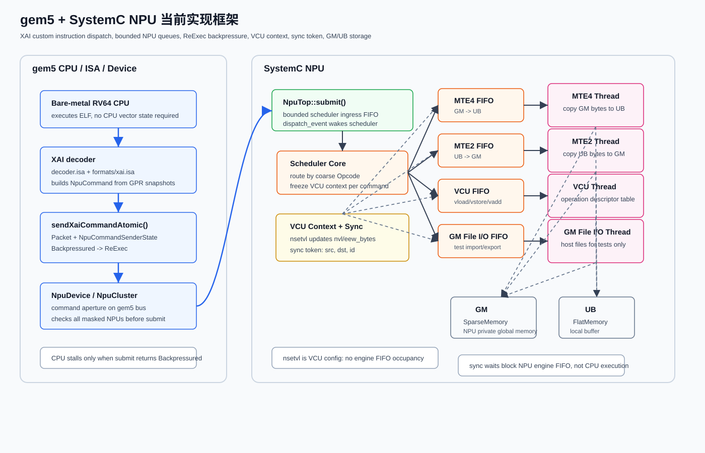
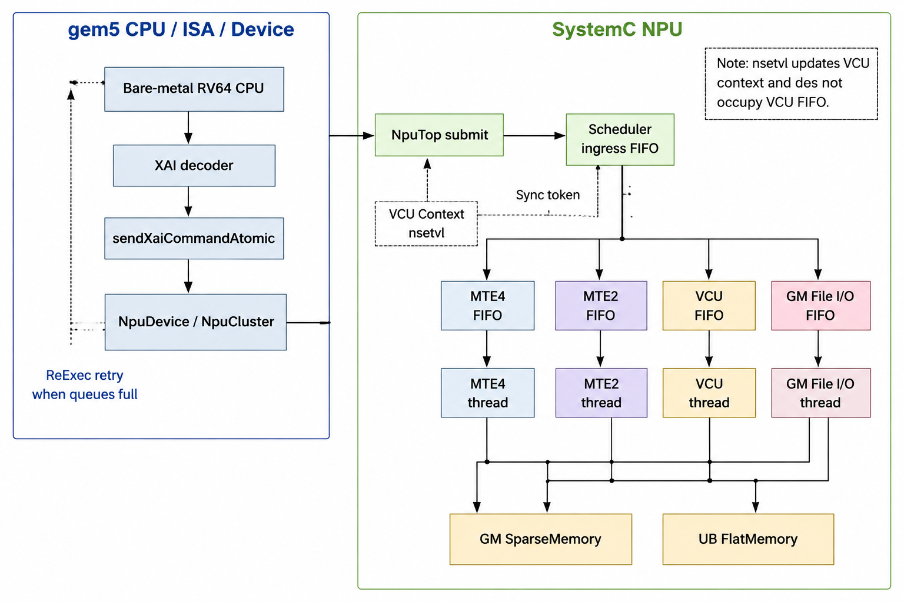

# gem5 + SystemC NPU 当前实现总览

本文档按当前代码实现描述 NPU MVP 的整体逻辑。实现入口主要位于 `gem5/src/arch/riscv/isa/`、`gem5/src/dev/npu/` 和 `npu-tests/`。

## 1. 总体目标

当前仿真器在 gem5 RV64 CPU 与 SystemC NPU 之间建立一条私有 XAI 指令通路。CPU 运行 bare-metal ELF，通过 RISC-V `custom-2` 编码提交 NPU 命令；NPU 在 SystemC 侧维护 GM、UB、VCU context、各模块 FIFO 和同步 token。

当前支持的最小数据流是：

```text
GM input file -> GM -> MTE4 -> UB -> VCU vload/vadd/vstore -> UB -> MTE2 -> GM -> GM output file
```

其中 GM 文件读写是仿真辅助能力，用于测试数据导入和结果导出，不表示真实硬件文件系统。

## 2. 框架图



### AI 版框图



## 3. 代码模块分层

| 层级 | 主要文件 | 当前职责 |
|---|---|---|
| XAI ISA decode | `arch/riscv/isa/decoder.isa`、`formats/xai.isa` | 解码 custom-2 指令，读取 GPR 快照，构造 `NpuCommand`，通过 CPU data port 提交 |
| gem5 NPU device | `dev/npu/npu_device.*`、`npu_cluster.*` | 提供 NPU command aperture，将 gem5 packet 转成 SystemC TLM 命令，聚合一个或多个 NPU |
| SystemC NPU top | `dev/npu/npu_top.*` | 持有 GM/UB、scheduler、MTE、VCU、GM file I/O、sync 状态 |
| 调度器 | `dev/npu/npu_scheduler.*` | 接收 ingress FIFO，更新 VCU context，按 opcode 路由到目标 engine FIFO |
| 执行引擎 | `npu_mte*.cc`、`npu_vcu.cc`、`npu_gm_file_io.cc`、`npu_sync.cc` | 各模块独立 SystemC thread，按 FIFO 顺序执行命令 |
| VCU 操作表 | `npu_vcu_operation.*` | 将 VCU 子 opcode 映射到具体 handler，例如 `vload`、`vstore`、`vadd` |
| 测试入口 | `npu-tests/scripts/verify_xai-elf.sh` | 编译 bare-metal ELF，运行 gem5，比较 GM 输出 |

## 4. 指令分类

当前 `Opcode` 是模块级粗分类：

```text
Mte4, Mte2, Vcu, Sync, GmFileIo
```

模块内部再用子 opcode 表示具体指令：

```text
VcuOpcode: Nsetvl, Load, Store, Add
SyncOpcode: Set, Wait
GmFileIoOpcode: WriteDataToGm, LoadDataFromGm
```

`nsetvl` 已归入 VCU 类，表现为 `Opcode::Vcu + VcuOpcode::Nsetvl`。它只更新当前 hart 的 VCU context，包括 `nvl` 和 `eew_bytes`，不进入 VCU 执行 FIFO，也不写回 CPU GPR。

## 5. CPU 到 NPU 的提交路径

1. `decoder.isa` 根据 `funct3/funct7` 选择 XAI 格式。
2. `xai.isa` 读取 `rd/rs1/rs2` 对应的 GPR 值，填充 `NpuCommand`。
3. `sendXaiCommandAtomic()` 创建 gem5 `Packet`，把 `NpuCommandSenderState` 压入 sender state。
4. gem5 NPU device 将 packet 转成 TLM transaction，并携带 `NpuCommandExtension`。
5. `NpuCluster::b_transport()` 先检查所有目标 NPU 是否可接收，再调用对应 `NpuTop::submit()`。
6. `NpuTop::submit()` 将命令放入 scheduler ingress FIFO，并通知 `dispatch_event`。

普通 XAI 指令是异步提交：只要 NPU 接收命令，CPU 就继续执行，不等待 NPU 模块完成。

## 6. 背压与 CPU 阻塞

NPU 侧有两级容量判断：

1. scheduler ingress FIFO 是否有空间。
2. 目标 engine FIFO 是否有空间。

`NpuTop::can_accept()` 会根据命令路由检查目标队列。`nsetvl` 是 context 更新命令，只检查 ingress FIFO，不受 VCU 执行 FIFO 容量影响。

当任一目标 NPU 无法接收命令时，`NpuCluster` 返回 `DispatchStatus::Backpressured`。XAI 指令侧收到该状态后返回 gem5 `ReExec` fault，CPU 保持 PC 不前进，在后续 tick 重新执行同一条 XAI 指令。这样可以用最小改动实现“队列满时阻塞 CPU 并重试”。

## 7. Scheduler 与执行顺序

`NpuTop::dispatch_ingress()` 按 ingress FIFO 顺序尝试派发命令：

```text
Nsetvl     -> 更新 VCU context
Mte4       -> MTE4 FIFO
Mte2       -> MTE2 FIFO
Vcu op     -> VCU FIFO
Sync set   -> source engine FIFO
Sync wait  -> destination engine FIFO
GmFileIo   -> GM file I/O FIFO
```

进入执行 FIFO 的命令会冻结当时的 VCU context。后续 `nsetvl` 不会改变已经排队的 VCU 命令。

同一 engine 内部严格 FIFO 顺序执行，不同 engine 之间可并行推进。跨 engine 的数据依赖不做自动分析，需要软件使用 `sync_set` 和 `sync_wait` 建立 token 依赖。

## 8. 存储模型

当前 NPU 有两个私有存储域：

| 存储 | 实现 | 用途 |
|---|---|---|
| GM | `SparseMemory` | NPU 全局内存，默认按页稀疏分配 |
| UB | `FlatMemory` | NPU 本地统一缓冲 |

MTE4 负责 GM 到 UB，MTE2 负责 UB 到 GM。VCU 只通过 UB load/store 访问 UB，不直接访问 GM。CPU 不通过普通 load/store 访问 GM 或 UB。

## 9. VCU 扩展方式

VCU 指令扩展集中在 `npu_vcu_operation.*`：

1. 在 `VcuOpcode` 中新增子 opcode。
2. 在 RISC-V decoder 中为新 `funct7` 绑定 `XaiVcuOp`。
3. 在 `npu_vcu_operation.cc` 中新增 execute handler。
4. 将 `{opcode, name, work_unit, work_rate, handler}` 加入 VCU operation descriptor 表。

这类扩展不需要修改 scheduler 的 opcode 分发逻辑，因为所有 VCU 指令都统一归入 `Opcode::Vcu`。

## 10. 当前验证流程

现有验证脚本为：

```bash
npu-tests/scripts/verify_xai-elf.sh run-smoke
npu-tests/scripts/verify_xai-elf.sh run-multinpu
```

`run-smoke` 验证单 NPU VADD 数据流，`run-multinpu` 验证单 CPU 向多个 NPU 广播命令并产生各自 GM 输出。
